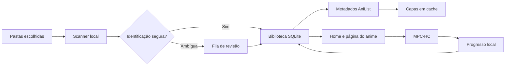

<p align="center">
  
</p>

<p align="center">
  <strong>Sua estante de animes no PC, organizada, bonita e sob o seu controle.</strong>
</p>

<p align="center">
  <a href="https://github.com/PedroVitor-Dev/AniT/actions/workflows/ci.yml"></a>
  
  
  <a href="LICENSE"></a>
</p>

<p align="center">
  <a href="#-comece-aqui">Comece aqui</a> ·
  <a href="docs/USER_GUIDE.md">Manual</a> ·
  <a href="docs/ROADMAP.md">Roadmap</a> ·
  <a href="CONTRIBUTING.md">Contribuir</a> ·
  <a href="SUPPORT.md">Suporte</a>
</p>

---

## O que é o AniT?

O **AniT** é um aplicativo desktop open source para Windows que transforma pastas de vídeos em uma biblioteca pessoal de animes. Ele identifica episódios, preserva o progresso local, encontra capas e metadados, destaca arquivos que precisam de revisão e integra a reprodução ao MPC-HC.

O projeto é **local-first**: sua biblioteca, avaliações e histórico ficam no seu computador. A internet é usada apenas quando o AniT consulta metadados públicos no AniList.

> [!IMPORTANT]
> O AniT está em desenvolvimento ativo. A base funcional já existe, mas interfaces, banco local e fluxos de distribuição ainda podem evoluir antes da primeira versão estável.

## ✨ Destaques

| Recurso | Como ajuda |
| --- | --- |
| **Biblioteca inteligente** | Escaneia vídeos em subpastas e oferece pesquisa instantânea por título principal ou em inglês. |
| **Reconhecimento seguro** | Interpreta nomes comuns de episódios e envia casos ambíguos para revisão em vez de adivinhar silenciosamente. |
| **Capas e metadados** | Consulta título em inglês, capa, sinopse e nota pública no AniList, mantendo cache local e fallback visual. |
| **Progresso local** | Salva posição, status e conclusão por episódio em SQLite. |
| **Página do anime** | Reúne episódios, sinopse, nota pública e avaliações pessoais por episódio. |
| **Conquistas e AniPoints** | Transforma uso real em 100 marcos persistentes, cadeias de progressão e conquistas secretas do Baki-Pi. |
| **Arquivos resilientes** | Reconhece arquivos movidos, diferencia versões e duplicatas físicas e preserva dados quando um disco fica offline. |
| **Organização opcional** | Gera uma prévia antes de mover vídeos e legendas sidecar; conflitos não são sobrescritos. |
| **Player integrado** | Usa uma distribuição portátil homologada do MPC-HC para reprodução e retomada. |

## 🔄 Como funciona



Nenhum arquivo é movido ou renomeado durante uma atualização comum. A organização física é um fluxo separado, opcional e precedido por uma prévia.

## 🚀 Comece aqui

### Requisitos

- Windows 10 ou 11, em arquitetura x64;
- [.NET 10 SDK](https://dotnet.microsoft.com/download/dotnet/10.0) para desenvolvimento;
- Git;
- MPC-HC portátil em `Player/MPC-HC/mpc-hc64.exe` para usar o player integrado.

### Executar a partir do código

```powershell
git clone https://github.com/PedroVitor-Dev/AniT.git
cd AniT
dotnet restore AniT.slnx
dotnet run --project src/AniT.App/AniT.App.csproj
```

Na primeira abertura, selecione a pasta onde seus animes estão armazenados. Depois, use **Biblioteca → Atualizar Títulos** para iniciar a identificação e baixar os metadados disponíveis.

Para configurar o player durante o desenvolvimento, consulte [Player/README.md](Player/README.md).

### Validar o projeto

```powershell
dotnet build AniT.slnx -c Release
dotnet test AniT.slnx -c Release --no-build
```

## 🧭 Fluxo de uso

1. Adicione uma ou mais pastas à estante.
2. Atualize os títulos e acompanhe o progresso da varredura.
3. Abra **Revisão** quando um nome de arquivo for ambíguo.
4. Entre na página do anime para acompanhar episódios, sinopse e avaliações.
5. Continue assistindo pelo player integrado; o progresso volta para a biblioteca.
6. Se quiser reorganizar os arquivos, gere e confira a prévia antes de executar.

O [manual de utilização](docs/USER_GUIDE.md) detalha cada etapa, os formatos de nome reconhecidos, backup e recuperação.

## 🧱 Arquitetura

```text
src/
├── AniT.App             Interface WPF e composição dos fluxos
├── AniT.Core            Domínio, parsing, matching e contratos
├── AniT.Infrastructure  SQLite, scanner, metadados e organização
└── AniT.Player          Integração com o MPC-HC
tests/
└── AniT.Tests           Testes de domínio e infraestrutura
```

As dependências apontam para dentro: a interface coordena os casos de uso, a infraestrutura implementa persistência e integrações, e o domínio permanece independente. Veja [Arquitetura](docs/ARCHITECTURE.md) para os fluxos, entidades e decisões técnicas.

## 🔐 Dados e privacidade

- Banco local: `%LOCALAPPDATA%\AniT\Data\anit.db`
- Capas em cache: `%LOCALAPPDATA%\AniT\Covers`
- Diagnósticos: `%LOCALAPPDATA%\AniT\Data\*.log`
- Backup de migração: criado ao lado do banco antes de alterações relevantes de esquema.

O AniT não envia sua biblioteca para um servidor próprio. Consultas de metadados são feitas diretamente ao AniList. Leia a [política de privacidade local](docs/PRIVACY.md).

## 📚 Documentação

| Documento | Conteúdo |
| --- | --- |
| [Central de documentação](docs/README.md) | Índice de todos os guias |
| [Manual de utilização](docs/USER_GUIDE.md) | Instalação, biblioteca, player e avaliações |
| [Arquitetura](docs/ARCHITECTURE.md) | Camadas, dados e fluxos internos |
| [Sistema de conquistas](docs/ACHIEVEMENTS.md) | 100 conquistas, AniPoints, regras, eventos e persistência |
| [Ambiente de desenvolvimento](docs/DEVELOPMENT.md) | Setup, comandos, padrões e testes |
| [Roadmap](docs/ROADMAP.md) | Direção do produto e prioridades |
| [Solução de problemas](docs/TROUBLESHOOTING.md) | Diagnóstico e recuperação |
| [Processo de release](docs/RELEASING.md) | Checklist de versionamento e publicação |
| [Governança](GOVERNANCE.md) | Papéis, decisões e manutenção |

## 🤝 Contribua

Contribuições de código, design, documentação, testes e pesquisa de experiência são bem-vindas.

1. Leia o [guia de contribuição](CONTRIBUTING.md) e o [Código de Conduta](CODE_OF_CONDUCT.md).
2. Procure uma issue existente ou abra uma usando os formulários do repositório.
3. Faça uma alteração pequena e focada, com testes proporcionais ao risco.
4. Abra um pull request preenchendo contexto, evidências e checklist.

Boas primeiras contribuições incluem novos casos de nomes de episódio, melhorias de acessibilidade, testes de scanner, documentação e refinamentos responsivos de WPF.

## 🗺️ Próximos passos

O foco atual é consolidar a biblioteca inteligente, melhorar acessibilidade e preparar distribuição confiável. Busca real, calendário, perfil, favoritos avançados e empacotamento estão organizados no [roadmap público](docs/ROADMAP.md).

## 📜 Licença e avisos

O código do AniT é distribuído sob a [GNU General Public License v3.0](LICENSE).

AniT é um projeto independente e não é afiliado ao AniList, MPC-HC, estúdios, distribuidoras ou serviços de streaming. O usuário é responsável por utilizar apenas mídias às quais tenha acesso legítimo. Imagens e metadados de terceiros permanecem sujeitos aos termos de seus respectivos provedores.

<p align="center">
  Feito com 💙, código aberto e carinho por boas histórias.
</p>
