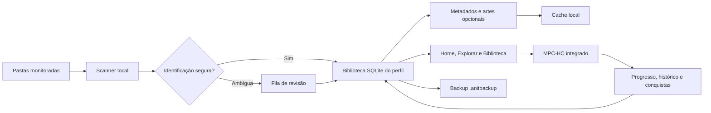

<p align="center">
  
</p>

<p align="center">
  <strong>Sua estante de animes no PC, organizada, bonita e sob o seu controle.</strong>
</p>

<p align="center">
  <a href="https://github.com/PedroVitor-Dev/AniT/actions/workflows/ci.yml"></a>
  <a href="https://github.com/PedroVitor-Dev/AniT/releases/latest"></a>
  
  
  <a href="LICENSE"></a>
</p>

<p align="center">
  <a href="https://github.com/PedroVitor-Dev/AniT/releases/latest"><strong>Baixar a versão mais recente</strong></a> ·
  <a href="docs/USER_GUIDE.md">Manual</a> ·
  <a href="docs/SETTINGS.md">Configurações</a> ·
  <a href="docs/BACKUP_AND_MIGRATION.md">Backup</a> ·
  <a href="SUPPORT.md">Suporte</a>
</p>

---

## O que é o AniT?

O **AniT** é um aplicativo desktop open source para Windows que transforma pastas de vídeos em uma biblioteca pessoal de animes. Ele identifica episódios, organiza títulos, preserva histórico e avaliações, encontra capas e metadados e integra a reprodução ao MPC-HC.

O projeto é **local-first**: perfis, biblioteca, conquistas, progresso e configurações ficam no seu computador. O acesso à internet é opcional e usado somente pelas fontes de metadados, tradução e artes habilitadas.

> [!NOTE]
> A versão estável atual é a **1.0.2**. O instalador é autossuficiente para Windows x64, não exige .NET instalado e ainda não possui assinatura digital. Confira o hash publicado antes de executar.

## Baixar e instalar

1. Abra a [release mais recente](https://github.com/PedroVitor-Dev/AniT/releases/latest).
2. Baixe `AniT-Setup-1.0.2-win-x64.exe` e `SHA256SUMS.txt`.
3. Compare o SHA-256 do instalador:

```powershell
Get-FileHash .\AniT-Setup-1.0.2-win-x64.exe -Algorithm SHA256
```

4. Execute o instalador, escolha o idioma e, se quiser, crie um atalho na Área de Trabalho.

O AniT é instalado somente para o usuário atual em `%LOCALAPPDATA%\Programs\AniT`. A desinstalação preserva os dados em `%LOCALAPPDATA%\AniT`; seus vídeos nunca são incluídos nem removidos pelo instalador.

Consulte o [guia de instalação, atualização e remoção](docs/INSTALLATION.md) para requisitos, SmartScreen e instalação silenciosa.

## Destaques da versão 1.0.2

| Recurso | Como ajuda |
| --- | --- |
| **Biblioteca sempre sincronizada** | Monitora pastas e subpastas, reconhece temporadas, episódios e especiais e retira da estante títulos cujos arquivos foram apagados sem perder a memória do usuário. |
| **Busca e filtros completos** | Pesquisa títulos, aliases, episódios e gêneros e filtra por gênero, ano, status, estúdio e ordenação. |
| **Perfis como na Netflix** | Escolha o perfil antes de entrar, mantenha jornadas separadas e proteja cada perfil com PIN numérico opcional. |
| **Backup portátil** | Exporta um único arquivo `.anitbackup`, valida integridade antes de restaurar e ajuda a religar arquivos que mudaram de nome ou pasta. |
| **Progresso e histórico** | Salva posição, conclusão, avaliações e comentários por episódio em SQLite local. |
| **Explorar e artes** | Organiza gêneros em mundos visuais, oferece múltiplas fontes de arte, conteúdo SFW, cache e bloqueio de uma arte escolhida. |
| **Calendário e conquistas** | Exibe atividade por dia e transforma o uso real em 100 conquistas persistentes e AniPoints. |
| **Personalização ampla** | Tema escuro, claro ou automático, escala, brilho, cards, mascotes, Home reordenável, notificações e atalhos. |
| **Player integrado** | Inclui MPC-HC portátil, retomada, checkpoints, limiar de conclusão, velocidade, tela cheia e próximo episódio. |
| **Operação segura** | Scan não move vídeos; organização e renomeação exigem prévia e confirmação e nunca sobrescrevem destinos. |

## Como funciona


```mermaid
flowchart LR
    A[Pastas monitoradas] --> B[Scanner local]
    B --> C{Identificação segura?}
    C -->|Sim| D[Biblioteca SQLite do perfil]
    C -->|Ambígua| E[Fila de revisão]
    E --> D
    D --> F[Metadados e artes opcionais]
    F --> G[Cache local]
    D --> H[Home, Explorar e Biblioteca]
    H --> I[MPC-HC integrado]
    I --> J[Progresso, histórico e conquistas]
    J --> D
    D --> K[Backup .anitbackup]
```

Nenhum arquivo é movido ou renomeado durante uma atualização comum. Organização física e renomeação são fluxos separados, opcionais e precedidos por uma prévia.

## Primeiros passos

1. Abra o AniT e escolha ou crie seu perfil; configure um PIN se desejar.
2. Adicione uma ou mais pastas em **Configurações → Biblioteca**.
3. Use **Biblioteca → Atualizar Títulos** para montar o catálogo.
4. Confira **Revisão** quando um arquivo não puder ser associado com segurança.
5. Abra um anime e reproduza um episódio para começar seu histórico.
6. Em **Configurações → Dados e backup**, gere seu primeiro `.anitbackup`.

O [manual de utilização](docs/USER_GUIDE.md) detalha as telas e o fluxo completo. A [referência de configurações](docs/SETTINGS.md) descreve todas as opções.

## Desenvolvimento

### Requisitos

- Windows 10 build 17763 ou posterior, ou Windows 11, x64;
- [.NET 10 SDK](https://dotnet.microsoft.com/download/dotnet/10.0);
- Git;
- MPC-HC 2.8.2 portátil em `Player/MPC-HC/mpc-hc64.exe` para reprodução integrada.

```powershell
git clone https://github.com/PedroVitor-Dev/AniT.git
cd AniT
dotnet restore AniT.slnx --locked-mode
dotnet build AniT.slnx -c Release --no-restore
dotnet test AniT.slnx -c Release --no-build --collect:"XPlat Code Coverage"
dotnet run --project src/AniT.App/AniT.App.csproj
```

Para preparar o player homologado, consulte [Player/README.md](Player/README.md). Para gerar o instalador, veja [Processo de release](docs/RELEASING.md).

## Arquitetura

```text
src/
├── AniT.App             Interface WPF e composição dos fluxos
├── AniT.Core            Domínio, parsing, matching e contratos
├── AniT.Infrastructure  SQLite, scanner, backups, metadados e organização
└── AniT.Player          Integração com o MPC-HC
tests/
└── AniT.Tests           Testes de domínio, infraestrutura e regressão
```

As dependências apontam para dentro: a interface coordena casos de uso, a infraestrutura implementa persistência e integrações e o domínio permanece independente. Veja [Arquitetura](docs/ARCHITECTURE.md).

## Dados e privacidade

- Dados principais: `%LOCALAPPDATA%\AniT\Data`
- Banco ativo: `%LOCALAPPDATA%\AniT\Data\anit.db`
- Bancos por perfil: `%LOCALAPPDATA%\AniT\Data\Profiles\<id>\anit.db`
- Capas: `%LOCALAPPDATA%\AniT\Covers`
- Cache: `%LOCALAPPDATA%\AniT\Cache`
- Backups automáticos padrão: `%USERPROFILE%\Documents\AniT Backups`

O AniT não possui backend próprio e não envia biblioteca, vídeos, histórico, PIN ou avaliações para um servidor AniT. Leia [Privacidade e dados locais](docs/PRIVACY.md) e [Backup e migração](docs/BACKUP_AND_MIGRATION.md).

## Documentação

| Documento | Conteúdo |
| --- | --- |
| [Central de documentação](docs/README.md) | Índice completo e versão documentada |
| [Instalação](docs/INSTALLATION.md) | Download, hash, atualização, remoção e instalação silenciosa |
| [Manual de utilização](docs/USER_GUIDE.md) | Perfis, biblioteca, reprodução, histórico e organização |
| [Configurações](docs/SETTINGS.md) | Referência das onze categorias de configuração |
| [Backup e migração](docs/BACKUP_AND_MIGRATION.md) | Conteúdo, importação, integridade e religação no novo PC |
| [Solução de problemas](docs/TROUBLESHOOTING.md) | Diagnóstico e recuperação |
| [Privacidade](docs/PRIVACY.md) | Dados locais, PIN, rede e exclusão |
| [Arquitetura](docs/ARCHITECTURE.md) | Camadas, persistência e integrações |
| [Conquistas](docs/ACHIEVEMENTS.md) | 100 conquistas, AniPoints e persistência |
| [Desenvolvimento](docs/DEVELOPMENT.md) | Ambiente, comandos, testes e padrões |
| [Roadmap](docs/ROADMAP.md) | Entregas atuais e direção futura |
| [Release](docs/RELEASING.md) | Validação, instalador, publicação e hotfix |

## Contribua

Contribuições de código, design, documentação e testes são bem-vindas. Leia o [guia de contribuição](CONTRIBUTING.md), o [Código de Conduta](CODE_OF_CONDUCT.md) e a [política de segurança](SECURITY.md). Faça alterações pequenas, focadas e acompanhadas de testes proporcionais ao risco.

## Licença e avisos

O código do AniT é distribuído sob a [GNU General Public License v3.0](LICENSE). Dependências e componentes distribuídos estão relacionados em [Avisos de terceiros](THIRD_PARTY_NOTICES.md).

AniT é um projeto independente e não é afiliado ao AniList, MPC-HC, estúdios, distribuidoras ou serviços de streaming. O usuário é responsável por utilizar apenas mídias às quais tenha acesso legítimo. Imagens e metadados de terceiros permanecem sujeitos aos termos de seus provedores.

<p align="center">Feito com 💙, código aberto e carinho por boas histórias.</p>
