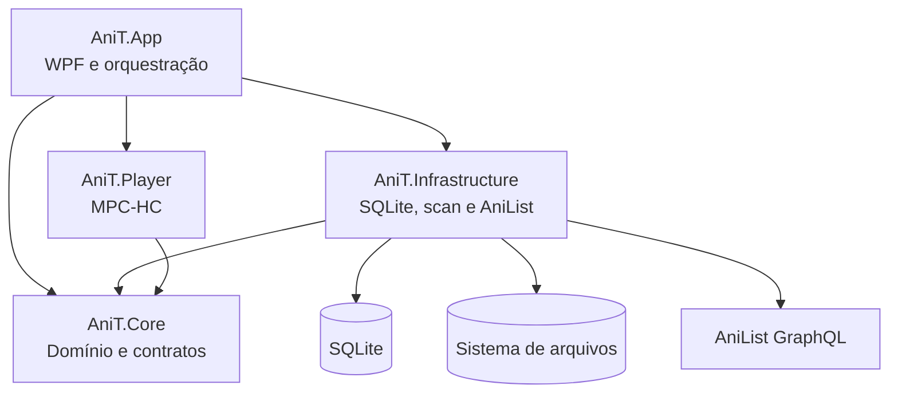
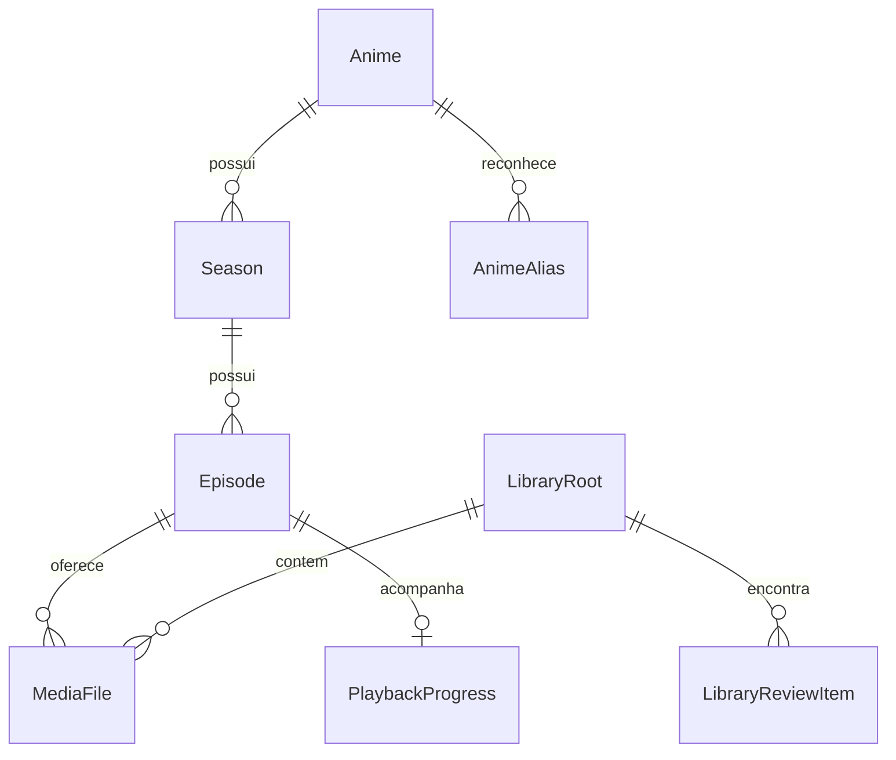

# Arquitetura

O AniT usa uma arquitetura em camadas para separar regras de negócio, integrações e interface. O objetivo é permitir que parsing, matching e persistência sejam testados sem depender da janela WPF.

## Visão geral

## Projetos

### `AniT.Core`

Não depende de WPF, SQLite ou rede. Contém:

- entidades `Anime`, `Season`, `Episode`, `MediaFile` e `PlaybackProgress`;
- contratos do player;
- parser de nomes de episódio;
- normalização, matching e explicação da confiança;
- modelos de revisão e organização;
- cálculo de progresso agregado.

### `AniT.Infrastructure`

Implementa os limites externos:

- `AniTDbContext` e inicialização/migração compatível do SQLite;
- varredura incremental e reconciliação de arquivos;
- impressão rápida para detectar movimentos e duplicatas;
- fila de revisão e aliases aprendidos;
- consulta GraphQL e cache de capas do AniList;
- prévia, execução e rollback do organizador.

### `AniT.Player`

Implementa `IMediaPlayer` sobre o MPC-HC, usando sua API de comandos para abrir, pausar, buscar posição e observar encerramento.

### `AniT.App`

Contém janelas WPF, recursos visuais e coordenação dos casos de uso. A interface abre contextos de banco de curta duração quando precisa observar mudanças feitas pelo player ou por tarefas assíncronas.

## Modelo de dados

Um episódio é uma entidade lógica; `MediaFile` representa uma versão física. Essa separação permite várias resoluções ou idiomas para o mesmo episódio sem duplicar o progresso.

## Fluxo de atualização

1. `LibraryScanner` enumera somente extensões de vídeo suportadas.
2. Arquivos conhecidos e inalterados são ignorados rapidamente.
3. A impressão rápida ajuda a reconhecer movimentos e cópias físicas.
4. `EpisodeFileNameParser` extrai título, temporada, episódio e metadados de release.
5. `AnimeMatcher` compara títulos canônicos e aliases.
6. Resultados confiáveis atualizam a biblioteca; ambiguidades criam `LibraryReviewItem`.
7. Metadados opcionais são consultados no AniList e persistidos com a capa em cache.

## Princípios de segurança de dados

- Um scan comum nunca move ou exclui mídia.
- Uma raiz offline preserva registros e marca disponibilidade.
- Organização exige prévia e seleção explícita.
- Destinos existentes bloqueiam a operação.
- Movimentos parciais tentam rollback.
- Alterações de esquema criam backup legado uma vez.

## Concorrência e UI

Operações de I/O são assíncronas. Janelas que carregam metadados usam cancelamento e proteção contra carregamentos concorrentes. Atualizações visuais devem permanecer no dispatcher WPF; serviços de domínio e infraestrutura não devem depender dele.

## Adicionando um recurso

1. Modele regra e tipos puros em `AniT.Core`.
2. Implemente persistência ou integração em `AniT.Infrastructure`/`AniT.Player`.
3. Cubra parsing, matching, migração e I/O crítico com testes.
4. Componha o fluxo em `AniT.App`.
5. Atualize manual, arquitetura e roadmap quando o comportamento público mudar.

Decisões novas que alterem essas fronteiras devem ser explicadas no pull request antes de introduzir dependências cruzadas.
