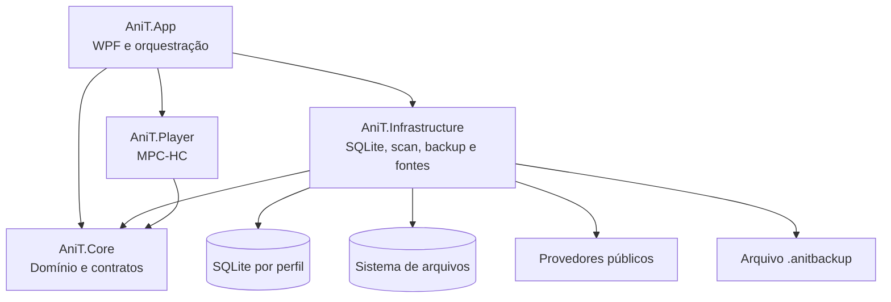
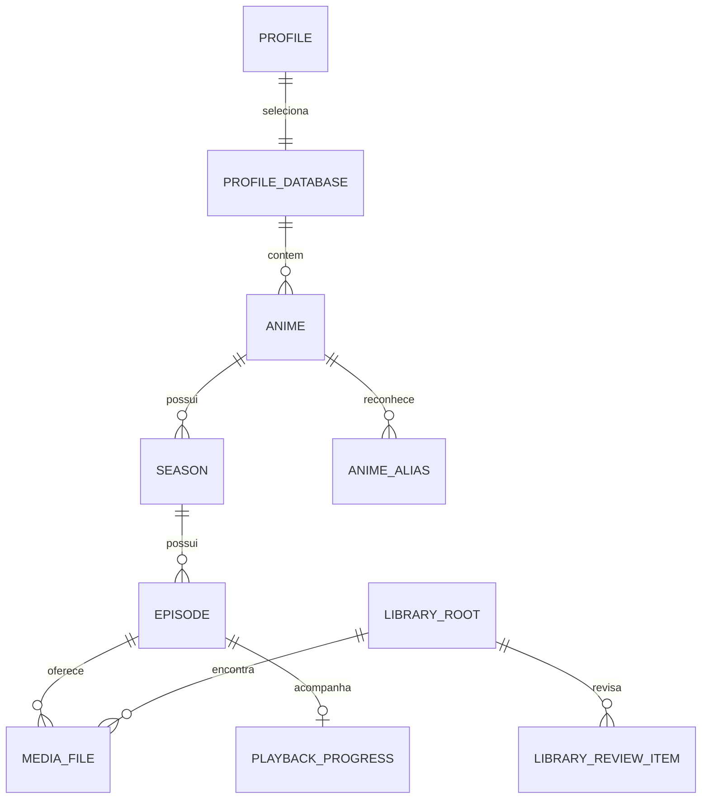

# Arquitetura

O AniT usa uma arquitetura em camadas para separar regras de negócio, persistência, integrações e WPF. Parsing, matching, backup e reconciliação podem ser testados sem abrir a interface.

## Visão geral

```mermaid
flowchart TB
    APP[AniT.App<br/>WPF e orquestração]
    CORE[AniT.Core<br/>Domínio e contratos]
    INFRA[AniT.Infrastructure<br/>SQLite, scan, backup e fontes]
    PLAYER[AniT.Player<br/>MPC-HC]
    DB[(SQLite por perfil)]
    FS[(Sistema de arquivos)]
    API[Provedores públicos]
    BKP[Arquivo .anitbackup]

    APP --> CORE
    APP --> INFRA
    APP --> PLAYER
    INFRA --> CORE
    PLAYER --> CORE
    INFRA --> DB
    INFRA --> FS
    INFRA --> API
    INFRA --> BKP
```

## Projetos

### `AniT.Core`

Não depende de WPF, SQLite ou rede. Contém entidades de anime, temporada, episódio, arquivo e progresso; contratos; parser; normalização; matching; revisão; organização e resultados de domínio.

### `AniT.Infrastructure`

Implementa limites externos:

- `AniTDbContext`, criação e migração compatível do SQLite;
- scanner incremental, impressão rápida e reconciliação;
- revisão, aliases, duplicatas, versões e indisponibilidade;
- metadados, artes, tradução, cache e política de rede;
- backup versionado, importação validada e exportação pessoal;
- prévia, execução e rollback de organização/renomeação;
- notificações, diagnósticos e persistência de configurações.

### `AniT.Player`

Implementa `IMediaPlayer` sobre o MPC-HC homologado. Abre mídia, consulta posição, aplica velocidade/tela cheia, cria checkpoints e observa encerramento. O player padrão do Windows é suportado sem rastreamento de progresso.

### `AniT.App`

Contém as janelas WPF, temas, recursos visuais e composição dos casos de uso: seletor de perfil, Home, Explorar, Biblioteca, calendário, histórico, conquistas, perfil, detalhes e configurações.

## Modelo lógico principal

```mermaid
erDiagram
    PROFILE ||--|| PROFILE_DATABASE : seleciona
    PROFILE_DATABASE ||--o{ ANIME : contem
    ANIME ||--o{ SEASON : possui
    ANIME ||--o{ ANIME_ALIAS : reconhece
    SEASON ||--o{ EPISODE : possui
    EPISODE ||--o{ MEDIA_FILE : oferece
    EPISODE ||--o| PLAYBACK_PROGRESS : acompanha
    LIBRARY_ROOT ||--o{ MEDIA_FILE : encontra
    LIBRARY_ROOT ||--o{ LIBRARY_REVIEW_ITEM : revisa
```

Um episódio é lógico; `MediaFile` representa uma versão física. Isso permite diferentes resoluções, fansubs ou containers sem duplicar progresso. Cada perfil ativo usa seu próprio snapshot de banco, enquanto configurações globais e o cadastro de perfis ficam no diretório comum.

## Perfis e entrada

`ProfileSelectionWindow` é o gate inicial. O cadastro fica em `Data/profiles.json`, com gravação atômica e cópia `.bak`. Bancos de perfis ficam em `Data/Profiles/<id>/anit.db`; o banco do perfil ativo é materializado como `Data/anit.db` durante a sessão.

O PIN é validado localmente por hash PBKDF2 com salt. O estado editável da tela nunca deve restaurar credenciais obsoletas; habilitar, trocar e remover PIN passam pelo serviço de perfis.

## Fluxo de atualização

1. `LibraryScanner` enumera extensões habilitadas e respeita exclusões.
2. Arquivos conhecidos e inalterados são ignorados.
3. A impressão rápida ajuda a reconhecer movimentos e cópias.
4. `EpisodeFileNameParser` extrai título, temporada, episódio e release.
5. `AnimeMatcher` compara nomes e aliases.
6. Resultados confiáveis atualizam a biblioteca; ambiguidades criam revisão.
7. Metadados e imagens opcionais passam pelas políticas de rede/cache.
8. Eventos alimentam Home, histórico, calendário, notificações e conquistas.

## Backup

O `.anitbackup` é um contêiner versionado com manifesto e hashes. O importador limita tamanho e quantidade, normaliza caminhos, rejeita traversal/duplicatas, valida o esquema AniT e cria uma cópia de recuperação antes da troca. Vídeos não entram no arquivo; a migração reconcilia novas raízes e permite religação manual.

## Segurança e resiliência

- Scan comum nunca move ou exclui mídia.
- Raiz offline preserva registros.
- Organização exige prévia e confirmação.
- Destinos existentes bloqueiam a operação; falhas parciais tentam rollback.
- Configurações e perfis usam gravação atômica e cópia de recuperação.
- Fontes personalizadas exigem HTTPS público e bloqueiam redes privadas.
- Downloads respeitam timeout, concorrência, tamanho e modo offline.
- Exportação CSV neutraliza células interpretáveis como fórmulas.

## Concorrência e UI

I/O é assíncrono e aceita cancelamento quando aplicável. Atualizações visuais permanecem no dispatcher WPF. Contextos EF Core têm vida curta. Tema, escala e redução de movimento são aplicados centralmente para evitar comportamento diferente entre páginas.

## Adicionando um recurso

1. Modele regras e tipos puros em `AniT.Core`.
2. Implemente persistência ou integração em `AniT.Infrastructure`/`AniT.Player`.
3. Cubra parsing, migração, segurança e I/O crítico com testes.
4. Componha o fluxo em `AniT.App` sem bloquear o dispatcher.
5. Atualize documentação, changelog e privacidade quando o comportamento público mudar.
